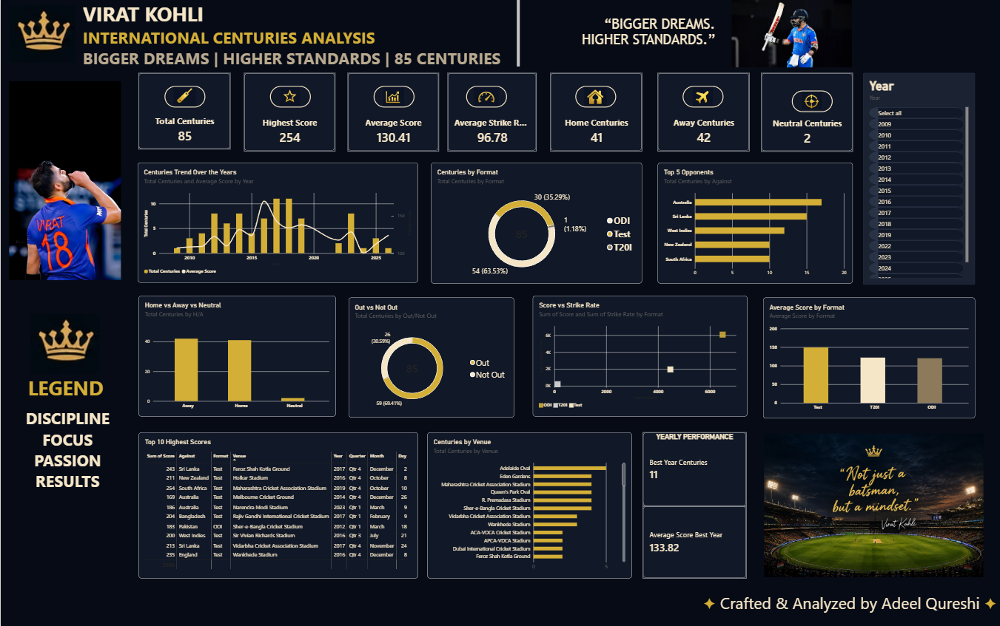

# 🏏 Virat Kohli – 85 International Centuries Analysis

## 📊 Project Overview

An interactive Power BI dashboard analyzing Virat Kohli's 85 international centuries across different years, formats, opponents, venues and match conditions.

## 🛠️ Tools & Technologies

- Power BI
- DAX
- Python
- Pandas
- MySQL
- Excel
- Data Visualization

## 🔍 Key Analysis

- Total International Centuries
- Average & Highest Score
- Average Strike Rate
- ODI vs Test vs T20I performance
- Home vs Away vs Neutral performance
- Top Opponents
- Out vs Not Out analysis
- Score vs Strike Rate relationship
- Year-wise performance trends
- Top 10 highest scores
- Venue-wise century analysis

## 📈 Dashboard

## 🎯 Objective

The objective of this project was to transform raw cricket data into an interactive and visually engaging dashboard while applying practical data analytics concepts.

## 👨‍💻 Created By

**Adeel Qureshi**

Aspiring Data Analyst
